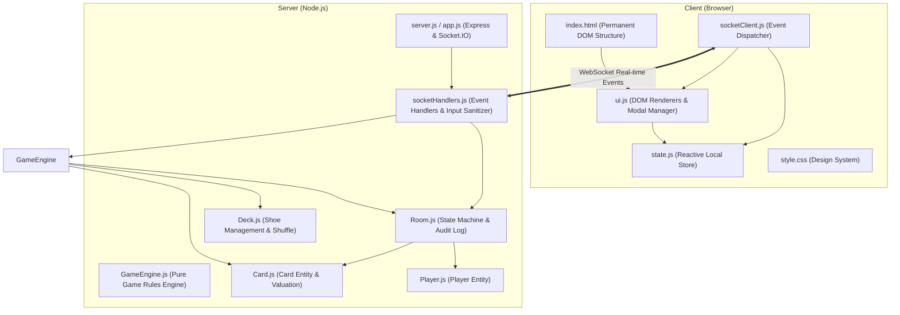

# Memory Cards Multiplayer — System Architecture

## 1. System Overview

**Memory Cards Multiplayer** is a real-time, hidden-information card game built with **Node.js, Express, and Socket.IO** on the backend and **vanilla modern JavaScript (ES6+), CSS3, and HTML5** on the frontend.

A central design pillar of this system is **Authoritative Networking & Hidden Hand Security**:
- Each player's browser *only ever* receives their own hand over the network.
- Opponents' face-down cards are never serialized or transmitted to other devices until the game reaches the `reveal` phase.
- All game mechanics (card draws, matching validations, penalty draws, powers, and scores) are evaluated authoritatively on the server.

---

## 2. Directory Structure

```
memory-cards-multiplayer/
├── docs/                             # Comprehensive technical documentation
│   ├── ARCHITECTURE.md               # High-level architecture and subsystem design (this file)
│   ├── GOLDEN_RULES.md               # Core architectural and engineering golden rules
│   ├── TESTING_AND_PERMUTATIONS.md   # Complete 92-test specification and permutation reference
│   ├── BUG_POSTMORTEM_PLAY_AGAIN.md  # Detailed root-cause analysis and resolution for Play Again
│   ├── API_AND_EVENTS.md             # Socket.IO event catalog, schemas, and contracts
│   └── scenarios/                    # Step-by-step scenario walkthroughs
│       ├── 01_LOBBY_AND_MATCHMAKING.md
│       ├── 02_DECK_AND_CARD_MECHANICS.md
│       ├── 03_TURN_LIFECYCLE_AND_DRAWING.md
│       ├── 04_MATCHING_AND_DISCARD_RULES.md
│       ├── 05_SPECIAL_POWERS_Q_AND_J.md
│       ├── 06_CALL_REVEAL_AND_SCORING.md
│       ├── 07_ROUND_RESET_AND_PLAY_AGAIN.md
│       └── 08_CLIENT_UI_AND_SYNCHRONIZATION.md
├── public/                           # Client-side static assets
│   ├── css/
│   │   └── style.css                 # Modular styles, CSS custom properties, responsive layout
│   ├── js/
│   │   ├── constants.js              # Client enums, phases, storage keys
│   │   ├── state.js                  # Reactive client store (identity, selections, server state)
│   │   ├── ui.js                     # DOM rendering, modal manager, non-destructive controls
│   │   ├── socketClient.js           # Socket.IO connection and event dispatcher
│   │   └── app.js                    # Client bootstrap and input listeners
│   └── index.html                    # Semantic, accessible game screen layouts
├── src/                              # Server-side modules
│   ├── config/
│   │   └── constants.js              # Centralized game constants, ranks, suits, configuration
│   ├── models/
│   │   ├── Card.js                   # Card valuation and public serialization
│   │   ├── Deck.js                   # Deck generation, Fisher-Yates shuffle, draw/reshuffle
│   │   ├── Player.js                 # Player model with private tokens and hand encapsulation
│   │   └── Room.js                   # Room container, turn tracker, audit log, public state
│   ├── services/
│   │   └── GameEngine.js             # Pure business logic: matching, penalties, powers, turns
│   ├── sockets/
│   │   └── socketHandlers.js         # Socket.IO event handlers and state broadcasting
├── test/                             # Automated test suite (92 tests across 10 suites)
│   ├── gameEngine.test.js            # Core unit tests for models and game rules
│   ├── socketHandlers.test.js        # Base socket integration tests
│   ├── scenario_01_*.test.js         # Scenario 1: Lobby & reconnection permutations
│   ├── scenario_02_*.test.js         # Scenario 2: Deck, card valuation & privacy permutations
│   ├── scenario_03_*.test.js         # Scenario 3: Turn lifecycle & slot permutations
│   ├── scenario_04_*.test.js         # Scenario 4: Matching & penalty permutations
│   ├── scenario_05_*.test.js         # Scenario 5: Queen peek & Jack swap permutations
│   ├── scenario_06_*.test.js         # Scenario 6: Call reveal, 0-card & scoring permutations
│   ├── scenario_07_*.test.js         # Scenario 7: Round reset & Play Again permutations
│   ├── scenario_08_*.test.js         # Scenario 8: Client UI, button states & XSS permutations
│   ├── socket_handlers_*.test.js     # Socket event isolation & channel privacy permutations
│   └── headed_suite.js               # Side-by-side visual headed browser runner
├── package.json                      # Project dependencies and npm scripts
├── README.md                         # Quick start guide and user overview
└── server.js                         # Application entrypoint
```

---

## 3. Separation of Concerns & Subsystems



### 3.1 Backend Architecture
1. **Application Bootstrap (`server.js`, `src/app.js`)**: Configures Express, static file hosting, CORS, and binds Socket.IO to the HTTP server.
2. **Socket Layer (`src/sockets/socketHandlers.js`)**: Intercepts WebSocket messages, validates input shapes, associates sockets with player identity, and dispatches actions to `GameEngine`.
3. **Domain Models (`src/models/`)**:
   - `Card`: Point valuations (Red King = -2, Black King = 13), sanitization (`toPublicCard`).
   - `Deck`: Multi-deck sizing (104 cards for $\le 5$ players, 156 cards for $> 5$), Fisher-Yates shuffling, draw pile reshuffling.
   - `Player`: Token-based reconnection credentials and private hand storage.
   - `Room`: Orchestrates active players, turn rotation, discard pile, audit log, and serializes public state.
4. **Game Engine (`src/services/GameEngine.js`)**: Pure business logic methods. Contains zero Socket.IO dependencies, making it 100% testable via standard unit tests.

### 3.2 Frontend Architecture
1. **Semantic HTML (`public/index.html`)**: Defines persistent containers for the lobby, game table, piles, hand, modals, and control groups.
2. **Non-Destructive Control Bar**: Divides controls into `#gameplayControls` and `#revealControls`. Elements are never replaced or destroyed with `.innerHTML`.
3. **State Store (`public/js/state.js`)**: Manages the local player's private identity (`pid`, `token`, `name`, `roomCode`), active server state, card selection sets, and arrange flags.
4. **View Renderer (`public/js/ui.js`)**: Pure DOM manipulation, updating text badges, card faces, modal dialogs, and button disabled states.
5. **Network Controller (`public/js/socketClient.js`)**: Listens to server events (`state`, `yourDrawnCard`, `discardReveal`, `yourQPeek`, `errorMsg`) and forwards data to `Store` and `UI`.

---

## 4. Architectural Evolution (Before vs After)

| Dimension | Legacy Monolithic Architecture | Restructured Architecture |
| :--- | :--- | :--- |
| **Server Code** | Single 472-line `server.js` combining sockets, models, rules, and server setup. | Modular `src/` tree with dedicated models, pure `GameEngine`, and isolated socket handlers. |
| **Client Code** | Single 417-line `index.html` with inline `<style>` and `<script>` blocks. | Decoupled into `style.css`, `constants.js`, `state.js`, `ui.js`, `socketClient.js`, `app.js`. |
| **Control Bar Rendering** | Overwrote `.controls.innerHTML` during reveal phase, destroying buttons and crashing subsequent rounds. | Permanent `#gameplayControls` and `#revealControls` swapped cleanly via CSS classes. |
| **Round Reset / Play Again** | Caused `TypeError: Cannot set properties of null (setting 'disabled')` halting render. | Clean automated reset hook (`Store.resetRoundClientState()`) re-enabling all gameplay buttons. |
| **Testability** | 0 unit tests, tight coupling between socket listeners and game rules. | 9 automated tests via `node --test` covering all mechanics and socket lifecycles. |

