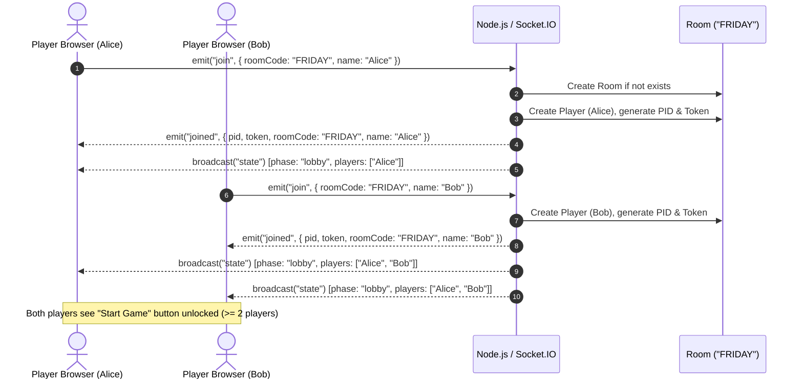

# Scenario 1: Lobby & Matchmaking

## 1. Overview
This segment covers player onboarding, room creation, joining existing tables, seat assignments, and persistent session recovery across browser refreshes.

---

## 2. Sequence Diagram



---

## 3. Key Components & Implementation

### 3.1 Room Creation & Normalization
- Handled in `src/sockets/socketHandlers.js`.
- Room codes are automatically trimmed, upper-cased, and truncated to 12 characters (`(roomCode || 'MAIN').trim().toUpperCase().slice(0, 12)`).
- Names are trimmed and capped at 16 characters.

### 3.2 Token Persistence & Reconnection
- **Storage**: When a player receives the `joined` event, their identity `{ pid, token, roomCode, name }` is saved to `localStorage` under the key `memcards_identity`.
- **Auto-Rejoin**: On WebSocket reconnect (`socket.on('connect')`), the client checks if `me.token && me.roomCode` are present in `Store`. If present, it automatically sends:
  ```javascript
  SocketClient.emit('rejoin', { roomCode: Store.me.roomCode, token: Store.me.token });
  ```
- **Server Match**: The server searches for the player by their secret `token`. When matched:
  - Updates `player.socketId = socket.id`.
  - Marks `player.connected = true`.
  - Re-joins socket rooms (`roomCode` and `player.pid`).
  - Broadcasts updated player rack to all peers.

---

## 4. Edge Cases & Validations
- **Duplicate Name**: If a new socket attempts to join an active room with an existing player's name (case-insensitive), the server emits `errorMsg: "That name is taken in this room — pick another."`
- **Game in Progress**: If a user tries to join an existing room that has already transitioned out of `lobby` (i.e. `phase !== 'lobby'`), the server denies entry: `"This game already started. Ask for a new room code."`
- **Minimum Players**: Starting the game requires at least 2 players (`MIN_PLAYERS: 2`).

