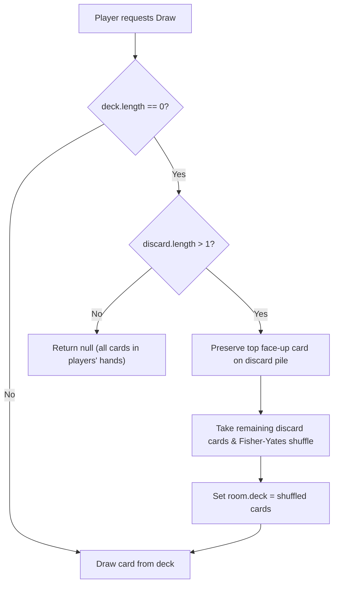

# Scenario 2: Card & Deck Mechanics

## 1. Overview
This segment documents the deck generation algorithms, multi-deck shoe scaling, point valuation rules (with special emphasis on Kings), and draw deck replenishment.

---

## 2. Card Valuation Rules

In Memory Cards, the goal is to end the round with the **lowest total score**. The point values are as follows:

| Card Rank | Suit / Color | Point Value | Special Gameplay Rules |
| :--- | :--- | :--- | :--- |
| **King (K)** | Hearts (♥), Diamonds (♦) — **Red** | **-2 points** | Best card in the game. Reduces player's total score. |
| **King (K)** | Spades (♠), Clubs (♣) — **Black** | **13 points** | High penalty card. Players strive to discard or swap it. |
| **Queen (Q)** | Any Suit | **12 points** | **Q Power**: Grants 1 timed peek at your own face-down cards upon discard. |
| **Jack (J)** | Any Suit | **11 points** | **J Power**: Grants 1 blind swap with an opponent's card upon discard. |
| **10** down to **2** | Any Suit | **Face Value (2–10)** | Standard numerical cards. |
| **Ace (A)** | Any Suit | **1 point** | Low point card. |

---

## 3. Multi-Deck Shoe Scaling

Implemented in `src/models/Deck.js`:

```javascript
function makeDeck(numPlayers) {
  const numDecks = numPlayers <= 5
    ? GAME_CONFIG.SMALL_GAME_DECK_COUNT   // 2 decks = 104 cards
    : GAME_CONFIG.LARGE_GAME_DECK_COUNT;  // 3 decks = 156 cards
  ...
}
```

- Each card is assigned a cryptographic UUID (`crypto.randomUUID()`) to prevent state spoofing.
- The deck is shuffled using the standard **Fisher-Yates (Knuth) algorithm**:
  $$O(N) \text{ time complexity, uniform distribution of permutations.}$$

---

## 4. Draw Deck Depletion & Discard Pile Reshuffle

When a player attempts to draw from an empty deck (`room.deck.length === 0`):



Implementation in `src/models/Deck.js`:
```javascript
function drawFromDeck(room) {
  if (room.deck.length === 0) {
    if (room.discard && room.discard.length > 1) {
      const topOpenCard = room.discard.pop();
      room.deck = shuffle(room.discard);
      room.discard = [topOpenCard];
      room.addLog('Draw pile was empty — reshuffled the discard pile (keeping the open card).');
    } else {
      return null;
    }
  }
  return room.deck.pop() || null;
}
```

