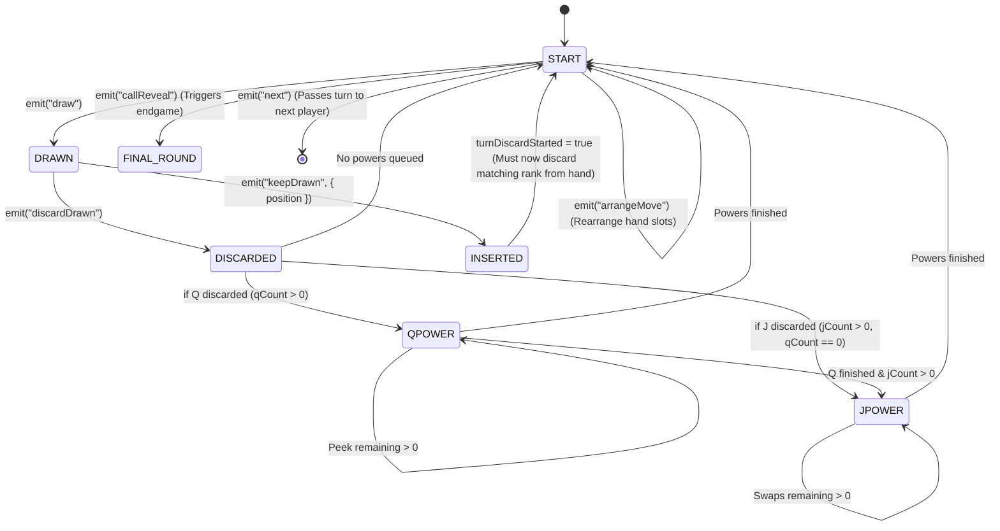

# Scenario 3: Turn Lifecycle & Drawing Mechanics

## 1. Turn State Machine

Each player's turn follows an authoritative server-controlled state machine:



---

## 2. Drawing Mechanics

### 2.1 The "Draw" Action
- Triggered by clicking the draw deck (`#drawPile`).
- Server validates:
  1. `room.isMyTurn(pid) === true`
  2. `room.stage === 'start'`
  3. `room.drawnThisTurn === false` (Draw limit: exactly once per turn).
- The drawn card is popped from `room.deck` and stored in `room.drawn`.
- The face of this single card is emitted exclusively to the active player via `yourDrawnCard`.
- `room.stage` becomes `'drawn'`.

### 2.2 Branch A: Discard Drawn (`discardDrawn`)
- The drawn card is immediately pushed onto the top of `room.discard`.
- `room.drawn` is cleared to `null`.
- The card is checked for Queens and Jacks via `queuePowersForCards()`.
- If powers exist, the turn stage enters `qpower` or `jpower`; otherwise, it returns to `start`.
- `room.drawnThisTurn` remains `true` so the player cannot draw again. The player may now optionally discard cards matching the open card, or click **Next ▶**.

### 2.3 Branch B: Keep Drawn (`keepDrawn`)
- The player selects an insertion index via the slot picker (`UI.openInsertPicker()`).
- The drawn card is inserted into the player's private hand array at that index:
  ```javascript
  player.hand.splice(idx, 0, room.drawn);
  ```
- **Crucial Rule Flag**: `room.turnDiscardStarted` is set to `true`.
- The player must now play at least one card from their hand to complete their turn.

---

## 3. Advancing the Turn (`next`)
When the active player finishes their actions and clicks **Next ▶**:
1. Server checks `room.isMyTurn(pid)` and `room.stage === 'start'`.
2. `advanceTurn(room)` rotates `currentIndex = (currentIndex + 1) % players.length`.
3. Checks if the incoming player was marked as `zeroPlayer` or `finalCaller` (which immediately triggers `revealAll()`).
4. Resets all temporary turn flags:
   ```javascript
   room.drawn = null;
   room.drawnThisTurn = false;
   room.turnDiscardStarted = false;
   room.stage = 'start';
   ```
5. Broadcasts the updated state so all clients update active player badges and hints.

