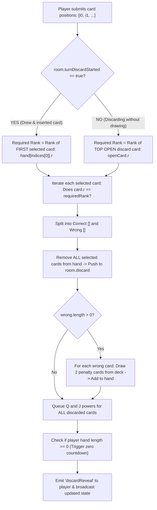

# Scenario 4: Matching & Discard Rules

## 1. Overview
Memory Cards allows players to reduce their hand size by discarding cards that match a required rank. The rank requirement depends entirely on whether the player drew/inserted a card this turn or is playing against the open discard pile.

---

## 2. The Two Discard Modes



---

## 3. Mathematical Rules for Penalties

1. **Selected Cards are Always Discarded**:
   Regardless of whether a selected card was correct or wrong, it is removed from the player's hand and placed face-up onto the discard pile.
2. **Penalty Formula**:
   $$\text{Penalty Cards Drawn} = 2 \times N_{\text{wrong}}$$
3. **Net Hand Change**:
   $$\Delta \text{Hand Size} = - N_{\text{correct}} + N_{\text{wrong}}$$
   - If a player guesses 1 correct card and 0 wrong cards: Hand decreases by 1 ($\Delta = -1$).
   - If a player guesses 0 correct and 1 wrong card: 1 card discarded, 2 penalty cards added $\implies$ Hand increases by 1 ($\Delta = +1$).
   - If a player guesses 1 correct and 1 wrong card: 2 cards discarded, 2 penalty cards added $\implies$ Hand size stays identical ($\Delta = 0$), but cards are randomized.

---

## 4. Multi-Card Discards
A player can select **multiple cards at once** (e.g. they remember that card 1, card 3, and card 5 are all 8s).
- If all three are 8s, all three are discarded, reducing the player's hand by 3 cards in a single move!
- If two are 8s and one was mistakenly a 9, the two 8s and the 9 are discarded, and 2 penalty cards are drawn, resulting in a net reduction of 1 card.

---

## 5. Implementation Safeguards
Implemented in `src/services/GameEngine.js` (`matchSelected`):
```javascript
// Remove cards in descending index order to avoid index shift corruption:
for (let k = indices.length - 1; k >= 0; k--) {
  const removedCard = player.hand.splice(indices[k], 1)[0];
  room.discard.push(removedCard);
}
```
- Deduplicates incoming index arrays (`[...new Set(positions)]`).
- Rejects out-of-bounds or non-integer indices.
- Validates that at least one valid card is selected.

