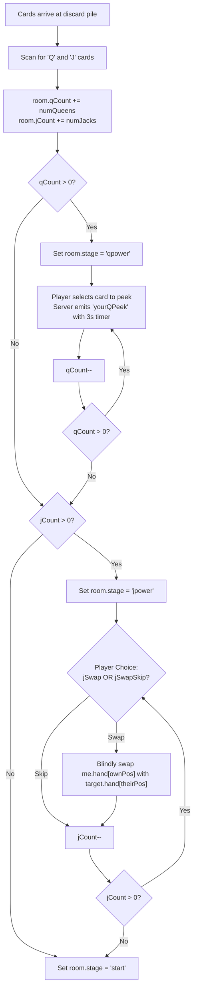

# Scenario 5: Special Powers (Queen Peek & Jack Blind-Swap)

## 1. Overview
When face cards of rank **Queen (Q)** or **Jack (J)** land in the discard pile, special interactive powers are triggered for the active player.

> [!NOTE]
> Powers trigger whenever a Q or J is placed onto the discard pile, regardless of whether it was discarded directly from the draw deck, matched correctly, or discarded as part of a wrong guess.

---

## 2. Power Resolution Sequence



---

## 3. Queen Power: Timed Private Peek

1. **Trigger**: `room.stage === 'qpower'`.
2. **Client Interaction**: `UI.openQPeekModal()` displays the player's own face-down cards.
3. **Selection**: Clicking a card sends:
   ```javascript
   SocketClient.emit('qPeekChoose', { position: idx });
   ```
4. **Server Handling**:
   - Decrements `room.qCount`.
   - Returns the card face via `yourQPeek`.
   - If `qCount == 0`, checks if `jCount > 0` to transition to `'jpower'`.
5. **Private Display**:
   - `UI.showQPeekDisplay()` renders the card face inside a modal with a 3-second countdown timer (`#peekTimer`).
   - Opponents receive zero card details (maintaining the authoritative privacy golden rule).
   - Once the timer reaches 0, the card is hidden and the modal is dismissed.

> [!IMPORTANT]
> **Reactive Render Immunity**: When the server processes the last peek, it transitions `room.stage` to `'start'` and broadcasts the new room state. To prevent `UI.render()` and `closeModalIfAutoFlow()` from prematurely hiding the peek modal, the client sets `Store.isPeeking = true` and `Store.autoModalOpen = 'q_display'`. This protects the modal from being closed or overwritten until the 3-second countdown fully completes.

---

## 4. Jack Power: Blind Swap

1. **Trigger**: `room.stage === 'jpower'`.
2. **Client Interaction**: `UI.openJSwapModal()` displays list of opponents.
3. **Step 1 — Target Selection**: Player picks which opponent to swap with (`UI.jChooseTarget`).
4. **Step 2 — Own Card Selection**: Player picks one of their own cards (`UI.jChooseOwn`).
5. **Step 3 — Opponent Card Selection**: Player picks one of the opponent's face-down cards (`UI.jFinish`).
6. **Execution**:
   ```javascript
   SocketClient.emit('jSwap', { targetPid, ownPos, theirPos });
   ```
7. **The "Blind" Principle & Table-Wide Notification**:
   - Neither the active player nor the opponent sees either card face (strictly preserving Golden Rule 1).
   - The server atomically swaps `me.hand[ownPos]` with `target.hand[theirPos]`.
   - **Table Broadcast**: The server broadcasts `jSwapNotice` to all players in the room, displaying a prominent announcement banner:
     `"[Player] exchanged Card #[ownCardNum] with [Opponent]'s Card #[theirCardNum] using J power."`
   - **Audit Log**: Formatted identically with 1-based card positions in `room.log` and displayed in the user-friendly updates feed.
   - **Client Modals**: Selection cards are explicitly labeled (`Card #1`, `Card #2`, etc.) so players intuitively know which slot they are selecting.
8. **Skipping**: The active player may choose to skip the swap at any time by clicking **Skip this swap** (`jSwapSkip`), decrementing `room.jCount` without modifying hands.

