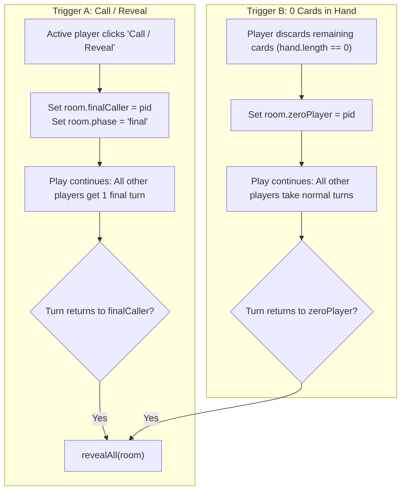

# Scenario 6: Call Reveal & Final Scoring

## 1. Overview
The game concludes when a player believes they have the lowest score and calls **Reveal**, or when a player successfully empties their hand to 0 cards. This initiates the final round countdown.

---

## 2. Endgame Triggers



---

## 3. The Reveal Phase (`phase: 'reveal'`)

When `revealAll(room)` executes:
1. `room.phase = 'reveal'`.
2. For the **first and only time** in the game, the server serializes all hands and computes total scores:
   ```javascript
   state.hands = this.players.map((p) => p.hand.map(toPublicCard));
   state.scores = this.players.map((p) =>
     p.hand.reduce((acc, card) => acc + getCardValue(card), 0)
   );
   ```
3. Hand totals use the official scoring rules:
   - **Red King (♥, ♦)**: $-2$ points
   - **Black King (♠, ♣)**: $+13$ points
   - **Aces**: $+1$ point
   - **Numbers 2–10**: Face value
   - **Jack**: $+11$ points
   - **Queen**: $+12$ points
   - **0-Card Hand**: $0$ points

---

## 4. UI Presentation & Ranking

1. **Card Rack Reveal**:
   - `UI.renderReveal()` displays each player's rack populated with their revealed face-up cards and point total.
   - Gameplay controls (`#gameplayControls`) are hidden.
   - Reveal controls (`#revealControls`) are made visible with the button: **Next — Show Ranking ▶**.
2. **Ranking Modal (`UI.showRanking()`)**:
   - Scores are sorted ascending:
     ```javascript
     const ranking = s.players
       .map((p, i) => ({ name: p.name, score: s.scores[i] }))
       .sort((a, b) => a.score - b.score);
     ```
   - Lowest score is awarded the Winner trophy (🏆).
   - Presents action buttons:
     - **Play Again (Same Players)** (`UI.onPlayAgainClick()`)
     - **New Game** (`UI.onNewGameClick()`)

