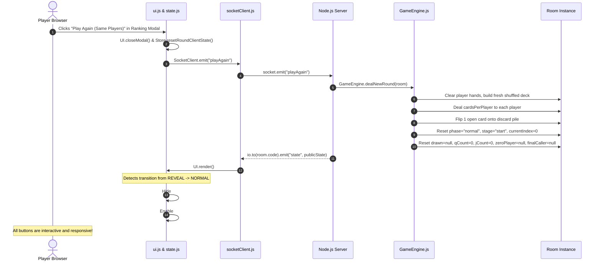

# Scenario 7: Round Reset & "Play Again"

## 1. Overview
When a game reaches the Final Ranking modal, players have two reset options:
1. **Play Again (Same Players)**: Re-deals a fresh round immediately with the same players and seats, bypassing the lobby.
2. **New Game**: Resets the room entirely back to the lobby.

This scenario document details the **Play Again** flow and explains how the architectural restructuring solved the button failure bug.

---

## 2. Sequence Diagram



---

## 3. Server-Side Execution (`GameEngine.dealNewRound`)

```javascript
static dealNewRound(room) {
  room.deck = makeDeck(room.players.length);
  room.discard = [];

  // Reset hands for all existing players
  for (const player of room.players) {
    player.clearHand();
  }

  // Deal cards round-robin
  for (let round = 0; round < room.cardsPerPlayer; round++) {
    for (const player of room.players) {
      player.hand.push(room.deck.pop());
    }
  }

  // Open the first discard card
  room.discard.push(room.deck.pop());

  // Reset game state machine
  room.currentIndex = 0;
  room.phase = GAME_PHASES.NORMAL;
  room.stage = TURN_STAGES.START;
  room.drawn = null;
  room.drawnThisTurn = false;
  room.turnDiscardStarted = false;
  room.qCount = 0;
  room.jCount = 0;
  room.zeroPlayer = null;
  room.finalCaller = null;
}
```

---

## 4. Client-Side Resolution (Preventing the Button Failure)

### 4.1 Automated Phase Transition Detection
In `public/js/ui.js`:
```javascript
render() {
  const s = Store.s;
  if (!s) return;

  // Detect transition from REVEAL -> NORMAL (Play Again triggered)
  if (this.previousPhase === UI_PHASES.REVEAL && s.phase === UI_PHASES.NORMAL) {
    Store.resetRoundClientState(); // Clears selected sets and modal flags
    this.closeModal();             // Closes the ranking popup
  }
  this.previousPhase = s.phase;
  ...
```

### 4.2 Safe Control Bar Swapping
Because `#gameplayControls` was preserved in the DOM (instead of being overwritten via `.innerHTML`), `#arrangeBtn`, `#discardSelBtn`, `#callBtn`, and `#nextBtn` are immediately accessible:

```javascript
renderControls(s) {
  const mine = Store.isMyTurn();
  const isStartStage = s.stage === UI_STAGES.START;

  // Swap containers cleanly
  this.$('gameplayControls').classList.remove('hidden');
  this.$('revealControls').classList.add('hidden');

  // Update button properties without DOM recreation
  this.$('discardSelBtn').disabled = !mine || !isStartStage;
  this.$('callBtn').disabled = !mine || !isStartStage;
  this.$('nextBtn').disabled = !mine || !isStartStage;
  this.$('arrangeBtn').disabled = !mine;
}
```

---

## 5. Summary of Fixes Applied

| Symptom | Old Implementation | Restructured Implementation |
| :--- | :--- | :--- |
| **Buttons missing after Play Again** | `controls.innerHTML` was overwritten in `renderReveal()`. | Permanent control groups with semantic `.hidden` class toggling. |
| **Uncaught TypeError on render** | `$('discardSelBtn').disabled` threw null reference error. | Elements always exist in DOM; zero null pointer exceptions. |
| **Ranking modal remained stuck** | Modal remained open on clients who didn't click the button. | Automatic `this.closeModal()` upon detecting `phase === 'normal'`. |
| **Ghost card selections** | Selection set from previous round persisted into new round. | Explicit `Store.resetRoundClientState()` clears all selections. |

