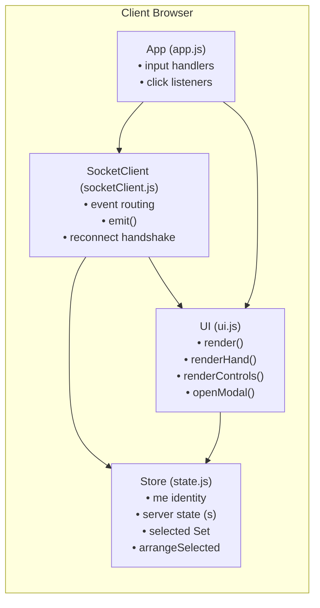
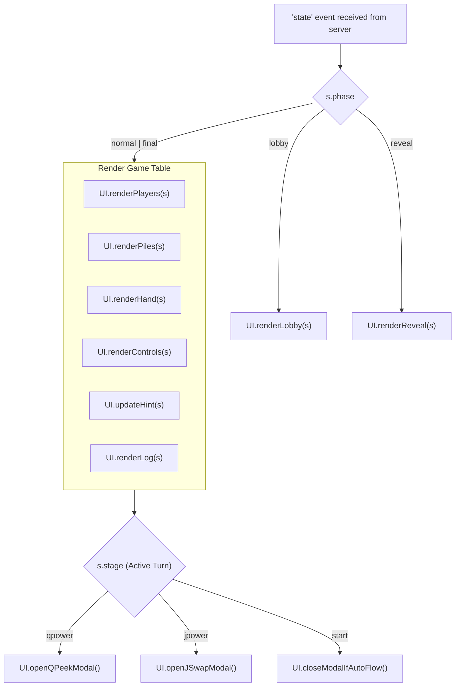

# Scenario 8: Client UI Architecture & Synchronization

## 1. Overview
The frontend is designed as a reactive, lightweight Single Page Application (SPA) driven by real-time WebSocket state broadcasts from the authoritative server.

---

## 2. Client Architecture Components



---

## 3. The Reactive Render Pipeline

Whenever the server broadcasts a new `'state'` event, `SocketClient` updates `Store.s` and calls `UI.render()`.



---

## 4. Modal Dialog Lifecycle & Race Condition Prevention

A common bug in real-time games is **modal flicker** — where an incoming background state broadcast causes a modal to repeatedly close or re-render while the user is actively making a choice.

To prevent this:
1. **`Store.autoModalOpen` Flag**:
   ```javascript
   openQPeekModal() {
     if (Store.autoModalOpen === 'q') return; // Do not re-open chooser if already displaying
     Store.autoModalOpen = 'q';
     ...
   ```
2. **`closeModalIfAutoFlow()` and `Store.isPeeking`**:
   Only automatically closes the modal when `stage` returns to `'start'` and `autoModalOpen` was active. When displaying a peeked card with the 3-second timer, `Store.isPeeking = true` and `Store.autoModalOpen = 'q_display'` guard the modal against being closed prematurely by incoming state updates.
3. **Universal Container**: A single `#modal` backdrop contains `#modalBox`. Dialogs replace only the inner modal contents rather than polluting the main table hierarchy.

---

## 5. Control Bar Availability Matrix

Action buttons are rendered deterministically without DOM teardown (`#gameplayControls` vs `#revealControls`).

| Button | ID | Enabled Condition | Description |
| :--- | :--- | :--- | :--- |
| **Arrange** | `#arrangeBtn` | `hasCards && isPlayPhase` | **Always available** to all players during active gameplay. |
| **Discard selected** | `#discardSelBtn` | `hasCards && isPlayPhase` | **Always available** to all players during active gameplay (supports out-of-turn discards). |
| **Call / Reveal** | `#callBtn` | `isMyTurn && stage === 'start'` | Only available to active player at turn start. |
| **Next ▶** | `#nextBtn` | `isMyTurn && stage === 'start'` | Only available to active player at turn start. |

---

## 6. Visual Design System & Card Ergonomics

1. **Card Aspect Ratio**: Fixed $68\text{px} \times 98\text{px}$ cards with $9\text{px}$ border-radius, styled with repeating linear gradients to simulate casino felt table textures and bicycle-back playing cards.
2. **Card Selection**: When tapped, cards translate $-8\text{px}$ upwards with a vibrant gold outline (`--gold: #ffc857`), providing clear tactical feedback on touchscreens and mobile devices.
3. **Final Round Ambience**: When someone calls Reveal, `.table.final` applies a deep crimson radial gradient transition, clearly signaling the high-stakes final turns to all players.
4. **XSS Protection**: All user names, room codes, and logs are escaped with `UI.esc()` before rendering.
5. **Non-Destructive Reveal Transition & Layout Collapsing**: During the endgame `reveal` phase, `#handArea` is cleanly collapsed with `.hidden` without destroying DOM nodes, eliminating blank space above the `#showRankingBtn` while preserving permanent control nodes.
6. **Top-Right Header Bar**: Card count is omitted from the top-right corner to keep the interface focused on player cards, and `#statusBadge` automatically hides when empty, preventing empty pill badges.
7. **In-Panel Minimizable Updates Feed & Responsive Layout**: Game events are displayed in an in-place feed inside `.handPanel` below `#hint`. Players can minimize the feed at any time using the `▼ Minimize` button (collapsing into a compact one-line status showing total count and latest event summary) or expand it via `▲ Expand`. The feed renders latest events on top with a `NEW` badge and visual category icons (🔄 for Jack swaps, 👁️ for Queen peeks, ⚠️ for penalties, 🎴 for draws, ✨ for discards/matches, and 📢 for calls). The game table utilizes a flex column layout with `overscroll-behavior: contain` and compact responsive sizing on smaller screens (`max-width: 768px`, `max-height: 760px`), ensuring the background wraps cleanly and the page does not start scrolling when expanded.
8. **Dual Ephemeral Banners**: `#errBanner` for non-blocking error feedback (red) and `#noticeBanner` for room-wide game announcements (cyan/gold).
